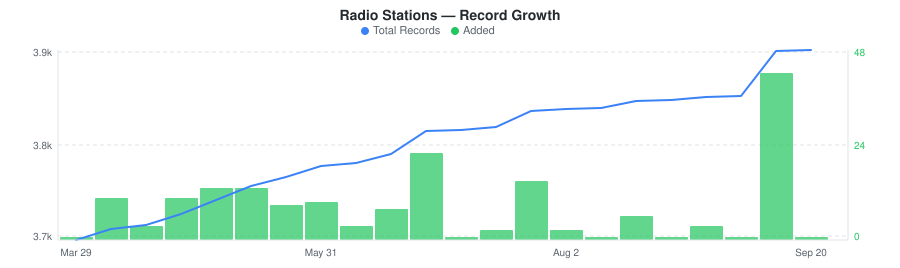
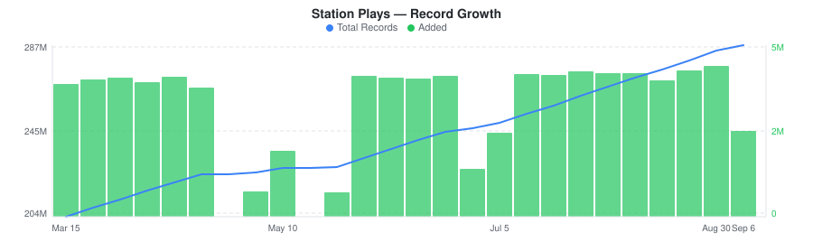

# iHeart Radio Stations & Airplay Dataset

&nbsp;&nbsp;[](https://rebrowser.net/products/datasets/iheart)

Thousands of US and Mexico radio station profiles with audience metrics, streaming URLs, and real-time airplay tracking.


The [iHeart dataset](https://rebrowser.net/products/datasets/iheart) on Rebrowser is **free** — but GitHub has file size and storage limits, so this repo contains a limited sample. For the full dataset (200.8M records, updated daily), visit [rebrowser.net/products/datasets/iheart](https://rebrowser.net/products/datasets/iheart).


This dataset contains **2** entities, each in its own folder: Radio Stations (`stations`), Station Plays (`station-plays`). See below for a full field breakdown, sample counts, and data distributions for each.

*Found this useful? ⭐ Star this repo to help us keep publishing fresh data. Found an error? [Let us know](https://rebrowser.net/contact-us).*


---

### Radio Stations
iHeart radio stations with call letters, frequencies, formats, market data, audience metrics, and streaming endpoints.


> **3,675** total records from 2025-12-28 to 2026-03-08, **3,672** rows in this sample (99.9% of full dataset).
> Exported as a single file, overwritten daily.



| Field | Type | Fill Rate | Description |
| --- | --- | --- | --- |
| `_primaryKey` | `string` | 100% | Unique identifier for this record |
| `_firstSeenAt` | `datetime` | 100% | First time this record was seen |
| `_lastSeenAt` | `datetime` | 100% | Last time this record was updated |
| `stationId` | `string` | 100% | iHeart station ID (numeric string) |
| `name` | `string` | 100% | Station display name |
| `description` | `string` | 100% | Station tagline or description |
| `callLetters` | `string` | 100% | FCC call letters with band suffix |
| `band` | `string` | 100% | Broadcast band (FM, AM, FL for digital, HD2/HD3/HD4 for HD radio) |
| `frequency` | `string` | 70% | Broadcast frequency. Null for digital-only stations |
| `format` | `string` | 78% | Station format |
| `provider` | `string` | 100% | Station owner or network |
| `cume` 🔒 | `float` | 64% | Cumulative weekly audience estimate |
| `country` | `string` | 100% | Country code |
| `marketId` | `string` | 100% | Primary market ID |
| `marketName` | `string` | 100% | Primary market name |
| `marketCity` | `string` | 100% | Primary market city |
| `marketState` | `string` | 100% | State abbreviation |
| `primaryGenreId` | `float` | 100% | Primary genre ID |
| `primaryGenreName` | `string` | 100% | Primary genre name |
| `genres` | `array` | 100% | All genres with id, name, and primary flag |
| `logoUrl` 🔒 | `string` | 100% | Station logo URL |
| `website` | `string` | 62% | Station website URL |
| `link` | `string` | 100% | iHeart direct play link |
| `fccFacilityId` | `string` | 26% | FCC facility ID for licensed broadcast stations |
| `rds` | `string` | 16% | RDS (Radio Data System) hex code for FM broadcast |
| `streamingPlatform` | `string` | 61% | Streaming platform (revma, triton) |
| `hlsStreamUrl` 🔒 | `string` | 42% | Secure HLS stream URL |
| `shoutcastStreamUrl` 🔒 | `string` | 78% | Secure Shoutcast/AAC stream URL |
| `plsStreamUrl` 🔒 | `string` | 22% | PLS playlist stream URL |
| `talkbackEnabled` | `bool` | 100% | Station supports talkback/listener interaction |
| `socialFacebook` | `string` | 46% | Facebook page handle |
| `socialTwitter` | `string` | 41% | Twitter/X handle |
| `socialInstagram` | `string` | 18% | Instagram handle |
| `socialTiktok` | `string` | 2% | TikTok handle |
| `primaryPronouncement` | `string` | 32% | Voice assistant pronunciation text for station name |
| `modifiedAt` | `datetime` | 100% | Last modification timestamp from iHeart |


> 🔒 **Premium fields** are included in the data files but their values are replaced with `[PREMIUM]`. To access real values, [use our website](https://rebrowser.net/products/datasets/iheart).


#### Field Distributions


<details>
<summary><strong>Top Station Formats</strong> (<code>format</code>)</summary>


| Value | Count | Share |
| --- | --- | --- |
| NEWSTALK | 413 | `████░░░░░░░░░░░░░░░░` 18.7% |
| OTHER | 298 | `███░░░░░░░░░░░░░░░░░` 13.5% |
| COUNTRY | 294 | `███░░░░░░░░░░░░░░░░░` 13.3% |
| SPANISH | 210 | `██░░░░░░░░░░░░░░░░░░` 9.5% |
| CHRPOP | 204 | `██░░░░░░░░░░░░░░░░░░` 9.2% |
| Prov_Cumulus | 200 | `██░░░░░░░░░░░░░░░░░░` 9.1% |
| SPORTS | 176 | `██░░░░░░░░░░░░░░░░░░` 8.0% |
| ACMAINSTREAM | 148 | `█░░░░░░░░░░░░░░░░░░░` 6.7% |
| CLASSICHITS | 141 | `█░░░░░░░░░░░░░░░░░░░` 6.4% |
| ROCKCLASSIC | 125 | `█░░░░░░░░░░░░░░░░░░░` 5.7% |

</details>


<details>
<summary><strong>Band Distribution (AM/FM/HD/Digital)</strong> (<code>band</code>)</summary>


| Value | Count | Share |
| --- | --- | --- |
| FM | 1,931 | `███████████░░░░░░░░░` 52.5% |
| FL | 871 | `█████░░░░░░░░░░░░░░░` 23.7% |
| AM | 603 | `███░░░░░░░░░░░░░░░░░` 16.4% |
| HD2 | 194 | `█░░░░░░░░░░░░░░░░░░░` 5.3% |
| HD3 | 61 | `░░░░░░░░░░░░░░░░░░░░` 1.7% |
| PR | 9 | `░░░░░░░░░░░░░░░░░░░░` 0.2% |
| HD4 | 6 | `░░░░░░░░░░░░░░░░░░░░` 0.2% |

</details>


<details>
<summary><strong>Top Genres</strong> (<code>primaryGenreName</code>)</summary>


| Value | Count | Share |
| --- | --- | --- |
| US Partner Digital | 434 | `███░░░░░░░░░░░░░░░░░` 15.4% |
| News & Talk | 423 | `███░░░░░░░░░░░░░░░░░` 15.0% |
| Country | 395 | `███░░░░░░░░░░░░░░░░░` 14.0% |
| Top 40 & Pop | 343 | `██░░░░░░░░░░░░░░░░░░` 12.1% |
| Sports | 270 | `██░░░░░░░░░░░░░░░░░░` 9.6% |
| Oldies | 237 | `██░░░░░░░░░░░░░░░░░░` 8.4% |
| Spanish | 227 | `██░░░░░░░░░░░░░░░░░░` 8.0% |
| Hip Hop and R&B | 176 | `█░░░░░░░░░░░░░░░░░░░` 6.2% |
| Classic Rock | 170 | `█░░░░░░░░░░░░░░░░░░░` 6.0% |
| Soft Rock | 152 | `█░░░░░░░░░░░░░░░░░░░` 5.4% |

</details>


<details>
<summary><strong>Stations by State</strong> (<code>marketState</code>)</summary>


| Value | Count | Share |
| --- | --- | --- |
| states/US-NAT | 717 | `███████░░░░░░░░░░░░░` 34.7% |
| CA | 242 | `██░░░░░░░░░░░░░░░░░░` 11.7% |
| TX | 231 | `██░░░░░░░░░░░░░░░░░░` 11.2% |
| FL | 213 | `██░░░░░░░░░░░░░░░░░░` 10.3% |
| OH | 156 | `██░░░░░░░░░░░░░░░░░░` 7.5% |
| PA | 128 | `█░░░░░░░░░░░░░░░░░░░` 6.2% |
| NY | 118 | `█░░░░░░░░░░░░░░░░░░░` 5.7% |
| GA | 103 | `█░░░░░░░░░░░░░░░░░░░` 5.0% |
| TN | 82 | `█░░░░░░░░░░░░░░░░░░░` 4.0% |
| AL | 79 | `█░░░░░░░░░░░░░░░░░░░` 3.8% |

</details>


---

### Station Plays
Real-time track play log for iHeart stations — every song played with artist, title, timestamp, and station.


> **200,790,154** total records from 2015-08-30 to 2026-03-15, **up to 600,000** rows in this sample (0.30% of full dataset).
> Exported as one file per day, up to 10,000 rows each, last 60 days retained.



| Field | Type | Fill Rate | Description |
| --- | --- | --- | --- |
| `_primaryKey` | `string` | 100% | Unique identifier for this record |
| `playedAt` | `datetime` | 100% | Start time of track playback (UTC) |
| `_lastSeenAt` | `datetime` | 100% | Last time this record was updated |
| `stationId` | `string` | 100% | iHeart station ID (numeric string) |
| `title` | `string` | 100% | Track/song title |
| `artist` | `string` | 100% | Artist name(s), may include featured artists |
| `album` | `string` | 23% | Album title |
| `durationSeconds` | `float` | 23% | Track duration in seconds |
| `trackId` | `float` | 100% | iHeart track ID |
| `artistId` | `float` | 23% | iHeart artist ID |
| `albumId` | `float` | 23% | iHeart album ID |
| `stationName` | `string` | — | Station name (from stations table) |
| `stationFormat` | `string` | — | Station format (from stations table) |
| `stationState` | `string` | — | Station state (from stations table) |
| `stationPrimaryGenreName` | `string` | — | Station primary genre (from stations table) |


---

## Pre-built Views on Rebrowser

Rebrowser web viewer lets you filter, sort, and export any slice of this dataset interactively. These pre-built views are ready to open:


### Radio Stations


[Radio Stations with Audience Metrics](https://rebrowser.net/products/datasets/iheart/stations/views/radio-stations-with-audience-data) — 3,672 records

↳ `[{"field":"cume","op":"gt","value":0},{"sort":"cume DESC"}]`

[Oldies Radio Stations](https://rebrowser.net/products/datasets/iheart/stations/views/oldies-radio-stations) — 237 records

↳ `[{"field":"primaryGenreName","op":"is","value":"Oldies"},{"sort":"cume DESC"}]`

[News & Talk Radio Stations](https://rebrowser.net/products/datasets/iheart/stations/views/news-talk-radio-stations) — 423 records

↳ `[{"field":"primaryGenreName","op":"is","value":"News & Talk"},{"sort":"cume DESC"}]`

[Country Music Radio Stations](https://rebrowser.net/products/datasets/iheart/stations/views/country-radio-stations) — 395 records

↳ `[{"field":"primaryGenreName","op":"is","value":"Country"},{"sort":"cume DESC"}]`

[Sports Radio Stations](https://rebrowser.net/products/datasets/iheart/stations/views/sports-radio-stations) — 270 records

↳ `[{"field":"primaryGenreName","op":"is","value":"Sports"},{"sort":"cume DESC"}]`


*[See all 26 views →](https://rebrowser.net/products/datasets/iheart/stations)*


### Station Plays


[Recent Radio Track Plays](https://rebrowser.net/products/datasets/iheart/station-plays/views/recent-radio-plays) — 192,021,240 records

↳ `[{"sort":"playedAt DESC"}]`

[Track Plays with Album Metadata](https://rebrowser.net/products/datasets/iheart/station-plays/views/plays-with-album-metadata) — 37,850,187 records

↳ `[{"field":"album","op":"isNotEmpty"},{"sort":"playedAt DESC"}]`

[Country Radio Airplay Data](https://rebrowser.net/products/datasets/iheart/station-plays/views/country-radio-airplay) — 31,017,797 records

↳ `[{"field":"stationPrimaryGenreName","op":"is","value":"Country"},{"sort":"playedAt DESC"}]`

[Rock Radio Airplay Data](https://rebrowser.net/products/datasets/iheart/station-plays/views/rock-radio-airplay) — 14,040,847 records

↳ `[{"field":"stationPrimaryGenreName","op":"is","value":"Classic Rock"},{"sort":"playedAt DESC"}]`

[Long-Form Radio Content (5+ Min)](https://rebrowser.net/products/datasets/iheart/station-plays/views/long-form-radio-content) — 3,945,930 records

↳ `[{"field":"durationSeconds","op":"gt","value":300},{"sort":"playedAt DESC"}]`


*[See all 27 views →](https://rebrowser.net/products/datasets/iheart/station-plays)*


---

## Code Examples

```python
import pandas as pd

# ── Stations ────────────────────────────────────────────────────────────────
stations = pd.read_parquet('rebrowser/iheart-dataset/stations/data.parquet')

# Top 10 FM stations in Texas by weekly audience (cume)
texas_fm = stations[(stations['marketState'] == 'TX') & (stations['band'] == 'FM')]
print(texas_fm.nlargest(10, 'cume')[['callLetters', 'frequency', 'format', 'market', 'cume']]
      .to_string(index=False))

# Count stations per format, sorted by frequency
print(stations['format'].value_counts().head(15).to_string())

# All Country-format stations with a cume above 500k
big_country = stations[(stations['format'] == 'COUNTRY') & (stations['cume'] > 500_000)]
print(big_country[['callLetters', 'market', 'cume']].sort_values('cume', ascending=False))

# ── Station Plays ────────────────────────────────────────────────────────────
from pathlib import Path

# Load the last 7 days of airplay
files = sorted(Path('rebrowser/iheart-dataset/station-plays/data').glob('*.parquet'))[-7:]
plays = pd.concat([pd.read_parquet(f) for f in files])

# Most-played artists across the network
print(plays.groupby('artist').size().sort_values(ascending=False).head(20).to_string())

# Spin count for a specific song title
print(plays[plays['title'].str.contains('Blinding Lights', case=False, na=False)]
      .groupby('artist')['title'].count())

# Stations that played the most unique songs
print(plays.groupby('stationId')['trackId'].nunique().sort_values(ascending=False).head(10).to_string())
```

---

## Use Cases


### Radio Ad Planning

Filter stations by format, market, and audience size to build data-driven media plans. Compare reach across geographies to optimize ad spend.


### Airplay Monitoring

Track spin counts for specific songs or artists across the iHeart network. Measure how quickly new releases enter rotation and which formats drive the most plays.


### Broadcast Research

Analyze format distribution, ownership patterns, and station density across US markets. Detect format flips, ownership transfers, and programming trends over time.


---

## Full Dataset on Rebrowser


This repo publishes free research data (14 days freshness lag · up to 10,000 rows per file · up to 1 year of history). The complete, real-time dataset is at [rebrowser.net/products/datasets/iheart](https://rebrowser.net/products/datasets/iheart)

On Rebrowser you can:
- **Filter before you buy** — use the web UI to apply filters on any field and sort by any column. Preview results before purchasing. You only pay for records that match your criteria.
- **Export in your format** — CSV, JSON, JSONL, or Parquet depending on your plan.
- **Access via API** — integrate dataset queries into your pipelines and workflows.
- **Choose your freshness** — plans range from a 14-day lag to real-time data with no delay.
- **Select only the fields you need** — keep exports lean. Premium fields with richer data are available on higher plans.

[Pricing](https://rebrowser.net/pricing) starts at **$2 per 1,000 rows** with volume discounts.

---

## License & Terms

**Free for research and non-commercial use** with attribution. See [license terms](https://rebrowser.net/free-datasets-for-research#license) and [how to cite](https://rebrowser.net/free-datasets-for-research#citation).

```bibtex
@misc{rebrowser_iheart,
  author       = {Rebrowser},
  title        = {iHeart Radio Stations & Airplay Dataset},
  year         = {2026},
  howpublished = {\url{https://rebrowser.net/products/datasets/iheart}},
  note         = {Accessed: YYYY-MM-DD}
}
```

Commercial use requires a paid license — see [pricing](https://rebrowser.net/pricing). Use of this data is governed by the [Rebrowser Terms of Use](https://rebrowser.net/terms-of-use), which may be updated at any time independently of this repository.

---

## Disclaimer

Rebrowser is an independent data provider and is not affiliated with, endorsed by, or sponsored by iHeart. Any trademarks are the property of their respective owners. This dataset is compiled from publicly available information; we do not request or collect iHeart user credentials. By using this dataset, you agree to comply with iHeart's Terms of Service and all applicable laws and regulations. Images, logos, descriptions, and other materials included in this dataset remain the intellectual property of their respective owners and are provided solely for informational purposes. Rebrowser makes no warranties regarding the accuracy, completeness, or legality of the data and assumes no liability for how the data is used. You are solely responsible for ensuring that your use of this dataset does not infringe on the rights of any third party.


You can also find this data on [Kaggle](https://www.kaggle.com/datasets/rebrowser/iheart-dataset), [HuggingFace](https://huggingface.co/datasets/rebrowser/iheart-dataset), [Zenodo](https://doi.org/10.5281/zenodo.18705201).


